# References

- [node v22.7.x で TypeScript をそのまま実行する](https://zenn.dev/mizchi/articles/experimental-node-typescript)
- [Compile TypeScript code (Node.js)](https://learn.microsoft.com/visualstudio/javascript/compile-typescript-code-npm?view=vs-2022)

## Iconify

- [VS Code でも Mermaid で Azure アイコンを使ったアーキテクチャを書き隊](https://techblog.ap-com.co.jp/entry/2024/11/20/120544)
- [Markdown Preview Enhanced](https://marketplace.visualstudio.com/items?itemName=shd101wyy.markdown-preview-enhanced)
- [Importing SVG from directory](https://iconify.design/docs/libraries/tools/import/directory.html)

```shell
make run COMMAND="scripts/export-icons.ts --directory assets/icons --prefix test --output assets/icons.json"
```

### Azure

- [Download Azure icons to use in architecture diagrams and documentation](https://learn.microsoft.com/azure/architecture/icons/)

```shell
# Release workflow for Azure icons

VERSION=v21 # Update this version number as needed

# Create the directory for Azure icons
mkdir -p assets/azure/$VERSION

# Download the Azure icons from the official source

# Rename the files in the Azure icons directory
npx ts-node scripts/rename-files.ts -d ./assets/icons -p "^\\d+-icon-service-(.+)$"

# Export Azure icons to JSON format
npx ts-node scripts/export-icons.ts --directory assets/icons --prefix azure --output assets/azure/$VERSION/icons.json

# Create a new release branch for the Azure icons
git checkout -b releases/azure/$VERSION
```

#### Mermaid Example

```mermaid
architecture-beta

group rg1(azure:resource-groups)[Resource Group]

    group vnet1(azure:virtual-networks)[Virtual Network] in rg1
        group subnet1(azure:subnet)[Subnet] in vnet1
        service server(azure:virtual-machine)[Server] in subnet1

    service storage(azure:storage-accounts)[Storage] in rg1
    service nsg1(azure:network-security-groups)[NSG] in rg1
    service database(azure:sql-database)[Database] in rg1

    nsg1:L --> R:server{group}
```


